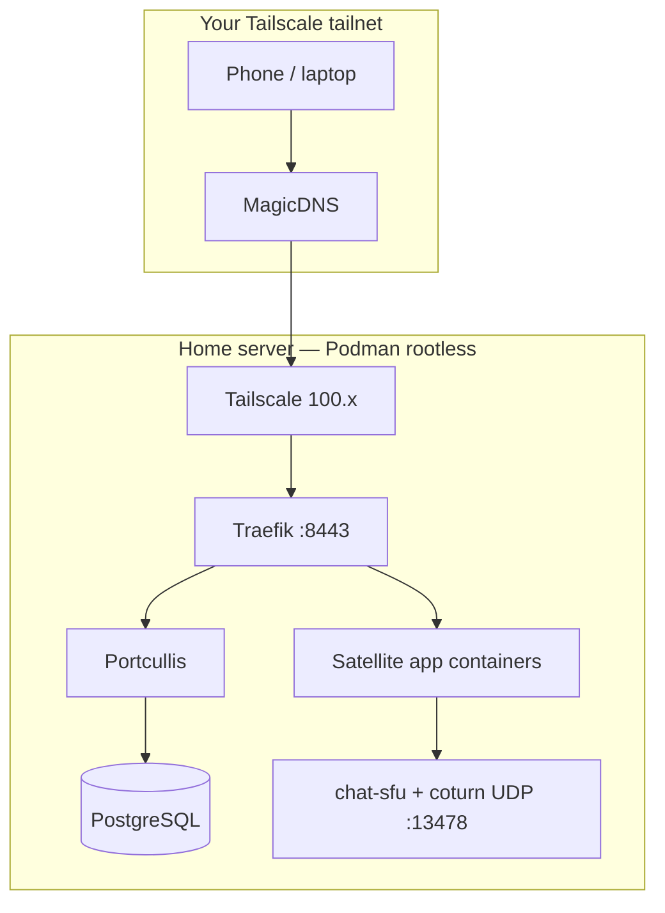

# Deploy Harbour with Podman and Tailscale

End-to-end guide to run the **full Harbour platform** on a single home server using **rootless Podman Compose**, reachable from phones and laptops **over Tailscale** (no router port-forwarding, no public internet exposure).

**Time:** first deploy ~30–60 minutes (mostly image builds).  
**Result:** `https://harbour.<your-tailnet>.ts.net:8443` with satellite apps at `https://harbour.<your-tailnet>.ts.net:8443/{app}` (e.g. `/notes`, `/chat`).

For local-only dev with `/etc/hosts`, see [phase-0-setup.md](./phase-0-setup.md).  
For Tailscale concepts without Podman detail, see [tailscale-remote-access.md](./tailscale-remote-access.md).

---

## What you are deploying

| Layer | Components |
|-------|------------|
| Edge | Traefik (HTTPS, routing) |
| Identity | Portcullis + PostgreSQL |
| Shell | harbour-platform-ui (launcher) |
| Apps | Notes, Docs, Gym, Recipes, Warehouse, Chat (+ SFU/TURN for voice) |
| Metrics | harbour-stack (`/api/stack` on shell host) |



**Hostname scheme:** one shell hostname (`harbour.<tailnet>.ts.net`); apps at path prefixes `/notes`, `/chat`, etc. on the same host.  
**Why `:8443`:** rootless Podman cannot bind privileged port 443 on the host. Clients must include the port in URLs.

---

## Prerequisites

### Accounts and hardware

- A machine that stays on at home (PC, mini PC, NAS-class x86 box)
- Linux with Podman 4+ (Fedora, RHEL, Ubuntu with Podman, etc.)
- A [Tailscale](https://tailscale.com) account (free tier is fine for personal use)
- Enough disk for images and app data (~20 GB+ comfortable)

### Software on the server

```bash
# Fedora / RHEL
sudo dnf install podman podman-compose git tailscale

# Enable rootless Podman socket (Traefik + harbour-stack need it)
systemctl --user enable --now podman.socket
loginctl enable-linger "$USER"   # socket survives logout (recommended)
```

Verify:

```bash
podman compose version
podman info --format '{{.Host.RemoteSocket.Path}}'
# e.g. /run/user/1000/podman/podman.sock
```

### Repository layout

Clone or copy all Harbour service repos as **siblings** under one workspace root:

```text
/home/you/Harbour/              ← HARBOUR_ROOT
  harbour-infra/
  harbour-platform-ui/
  portcullis/
  harbour-notes/
  harbour-docs/
  harbour-gym/
  harbour-recipes/
  harbour-outline/
  harbour-warehouse/
  harbour-chat/
  harbour-chat-sfu/
  harbour-stack/
```

Each folder is its own git repo. `harbour-infra` orchestration builds images from the siblings via `HARBOUR_ROOT`.

---

## Step 1 — Install Tailscale on the server

```bash
sudo systemctl enable --now tailscaled
sudo tailscale up
# Follow the auth URL to join your tailnet
```

Record the server’s stable tailnet IPv4:

```bash
tailscale ip -4
# Example: 100.64.0.42
```

In the [Tailscale admin console](https://login.tailscale.com/admin/machines):

1. **DNS → Enable MagicDNS**
2. Optional: rename this machine to `harbour` (MagicDNS will include `harbour.<tailnet>.ts.net`)
3. Optional: assign tag `tag:harbour` for ACLs (see [Step 3](#step-3--tailscale-split-dns))

Find your **tailnet DNS name** (Admin → DNS): it looks like `tailabc123.ts.net`.

---

## Step 2 — Configure Harbour for Podman + Tailscale

All commands below from `harbour-infra/` unless noted.

```bash
cd harbour-infra
chmod +x scripts/*.sh scripts/docker/*.sh scripts/lib/*.sh
```

Copy the Podman + Tailscale env template:

```bash
cp compose/.env.tailscale.example compose/.env
```

Edit `compose/.env`. Replace every `tailabc123` and `100.64.0.1` with your values:

| Variable | Example | Notes |
|----------|---------|-------|
| `HARBOUR_ROOT` | `/home/you/Harbour` | Absolute path to workspace root |
| `HARBOUR_DEPLOY_PROFILE` | `tailscale` | Skips `/etc/hosts` check; adds tailscale compose overlay |
| `HARBOUR_DNS_ZONE` | `harbour.tailabc123.ts.net` | Shell hostname |
| `HARBOUR_COOKIE_DOMAIN` | `.harbour.tailabc123.ts.net` | SSO cookie scope |
| `HARBOUR_TAILSCALE_IP` | `100.64.0.42` | From `tailscale ip -4` |
| `HARBOUR_PUBLIC_HTTPS_PORT` | `8443` | **Required for rootless Podman** |
| `HOST_HTTPS_PORT` | `8443` | Traefik host binding |
| `PORTCULLIS_ISSUER` | `https://harbour.tailabc123.ts.net:8443` | Must match browser URL |
| `VITE_OIDC_ISSUER` | same as issuer | Baked into UI at build |
| `VITE_HARBOUR_SHELL_URL` | same as issuer | Baked into UI at build |
| `SESSION_SECRET` | long random string | Min 16 chars; **change from example** |
| `POSTGRES_PASSWORD` | strong password | **change from example** |
| `SFU_ANNOUNCED_IP` | same as tailnet IP | Chat voice over tailnet |
| `CHAT_VOICE_TURN_URLS` | `stun:harbour.tailabc123.ts.net:13478,...` | Shell host, UDP |
| `TURN_REALM` | `harbour.tailabc123.ts.net` | coturn realm |

Generate synced hostname config (OAuth clients, app registry, launcher URLs):

```bash
./scripts/generate-public-config.sh
```

This updates:

- `portcullis/config/harbour-apps.json` and `clients.docker.json`
- `harbour-stack/config/harbour-apps.json`
- `harbour-platform-ui/public/config/services.registry.json`
- `docs/tailscale-dns-records.txt` ← path-based URL reference

**Important:** after any change to public URLs or DNS zone, re-run the generator and rebuild images.

---

## Step 3 — Tailscale machine name + trusted HTTPS

Rename the Harbour server machine to **`harbour`** in the Tailscale admin console so MagicDNS resolves `harbour.<tailnet>.ts.net` to its `100.x` address. All apps share that hostname with path prefixes (`/notes`, `/chat`, …) — **no split DNS** or per-app hostnames.

1. **MagicDNS** — leave **enabled** in [Tailscale admin → DNS](https://login.tailscale.com/admin/dns)
2. **HTTPS certificates** — **enable** (Let's Encrypt certs for machine FQDNs on your tailnet)
3. Rename machine → `harbour` (Machines → … → Edit machine name)
4. Set `HARBOUR_DNS_ZONE=harbour.<tailnet>.ts.net` and `HARBOUR_TRAEFIK_CONFIG=traefik.podman.tailscale.yml` in `compose/.env` (see `.env.tailscale.example`)
5. Re-run `./scripts/generate-public-config.sh` and `./scripts/up.sh --build`
6. **Cert operator (once per host)** — Traefik fetches certs via `tailscaled.sock`; non-root callers need permission:

```bash
sudo tailscale set --operator="$USER"
tailscale cert "harbour.<tailnet>.ts.net"   # should succeed without sudo
```

Traefik requests certificates from the host `tailscaled` via [`traefik.podman.tailscale.yml`](../traefik/traefik.podman.tailscale.yml). Each HTTPS router also needs `tls.certresolver=harbour-tailscale` (set in `docker-compose.tailscale.yml`).

### Verify

From the Harbour host (or any tailnet machine):

```bash
getent hosts harbour.tailabc123.ts.net
./scripts/verify-tls.sh
curl -I "https://harbour.tailabc123.ts.net:8443/"
```

`verify-tls.sh` uses `curl` **without** `-k` — success means a publicly trusted certificate. Also check `/notes/health` after sign-in.

No `/etc/hosts` entries are needed on clients when the machine name matches `HARBOUR_DNS_ZONE`.

### Optional ACL (recommended)

Restrict who can reach the Harbour host. Port **53 is not required** for web access:

```json
{
  "acls": [
    {
      "action": "accept",
      "src": ["group:family"],
      "dst": [
        "tag:harbour:8443",
        "tag:harbour:8081",
        "tag:harbour:13478",
        "tag:harbour:14050-14150",
        "tag:harbour:14200-14300"
      ]
    }
  ],
  "tagOwners": {
    "tag:harbour": ["autogroup:admin"]
  }
}
```

Tag the server machine `tag:harbour` and define `group:family` in the admin console.

---

## Step 4 — Build and start the stack

First run builds all images (10–30+ minutes depending on CPU):

```bash
./scripts/up.sh --build
```

`up.sh` will:

- Auto-detect `PODMAN_SOCKET` and write it to `compose/.env` if missing
- Run `generate-public-config.sh` when `HARBOUR_DEPLOY_PROFILE=tailscale`
- Compose files: `docker-compose.yml` + `build` + `podman` + `tailscale` overlays

Watch progress:

```bash
podman compose -f compose/docker-compose.yml logs -f traefik portcullis
```

When healthy, containers include at minimum:

```bash
podman ps --format '{{.Names}}\t{{.Status}}' | grep harbour
```

Expected names: `harbour-traefik`, `harbour-portcullis`, `harbour-postgres`, `harbour-platform-ui`, plus each satellite app.

---

## Step 5 — Verify on the server

Replace `tailabc123` with your tailnet name.

```bash
# HTTPS shell (trusted Tailscale / Let's Encrypt cert — no -k)
curl -I "https://harbour.tailabc123.ts.net:8443/"
./scripts/verify-tls.sh

# Portcullis health (via container network)
podman compose -f compose/docker-compose.yml exec portcullis \
  node -e "fetch('http://127.0.0.1:3000/health').then(r=>console.log(r.status))"
```

Open in a browser on the server (with Tailscale connected):

**https://harbour.tailabc123.ts.net:8443**

You should see the Harbour shell sign-in page **without** a certificate warning (after Step 3 HTTPS certificates are enabled).

Traefik dashboard (local only): **http://localhost:9080**

---

## Step 6 — Create users and grant app access

Harbour has **closed access** — no public signup. Provision users via CLI:

```bash
./scripts/user-admin.sh users create \
  --email you@family.example \
  --name "Your Name" \
  --password 'choose-a-strong-password'

# Grant launcher apps (repeat per app)
./scripts/user-admin.sh users grant-app --email you@family.example --app notes
./scripts/user-admin.sh users grant-app --email you@family.example --app docs
./scripts/user-admin.sh users grant-app --email you@family.example --app gym
./scripts/user-admin.sh users grant-app --email you@family.example --app recipes
./scripts/user-admin.sh users grant-app --email you@family.example --app outline
./scripts/user-admin.sh users grant-app --email you@family.example --app warehouse
./scripts/user-admin.sh users grant-app --email you@family.example --app board

./scripts/user-admin.sh users list
```

Valid app ids: `notes`, `docs`, `gym`, `recipes`, `outline`, `warehouse`, `board`, `tasks` (tasks reserved for future use).

Sign in at the shell URL. Launcher tiles open satellite apps on their tailnet hostnames.

---

## Step 7 — Client devices (phones, laptops)

On each device you want to use away from home:

1. Install [Tailscale](https://tailscale.com/download) and sign in to the **same tailnet**
2. Confirm MagicDNS is enabled (default on mobile)
3. Open **https://harbour.<tailnet>.ts.net:8443** — include **`:8443`**
4. Open **https://harbour.<tailnet>.ts.net:8443** — trusted HTTPS (no cert warning when Tailscale HTTPS certificates are enabled)
5. Sign in with the account from Step 6
6. **Install app (Android):** Chrome menu → **Install app** or **Add to Home screen** — standalone mode covers shell and all path-based satellites (`/notes`, `/chat`, …)

**App URLs** (all on the shell host, port 8443):

| App | URL |
|-----|-----|
| Shell | `https://harbour.<tailnet>.ts.net:8443` |
| Notes | `https://harbour.<tailnet>.ts.net:8443/notes` |
| Docs | `https://harbour.<tailnet>.ts.net:8443/docs` |
| Gym | `https://harbour.<tailnet>.ts.net:8443/gym` |
| Recipes | `https://harbour.<tailnet>.ts.net:8443/recipes` |
| Outline | `https://harbour.<tailnet>.ts.net:8443/outline` |
| Warehouse | `https://harbour.<tailnet>.ts.net:8443/warehouse` |
| Board | `https://harbour.<tailnet>.ts.net:8443/board` |

Sign in at the **shell** first so the session cookie is set for `.harbour.<tailnet>.ts.net`. Then launcher links and direct app URLs work.

---

## Step 8 — Verification checklist

Run through this after first deploy:

- [ ] All `harbour-*` containers running (`podman ps`)
- [ ] MagicDNS resolves `harbour.<tailnet>.ts.net` on phone
- [ ] Shell loads at `https://harbour.<tailnet>.ts.net:8443`
- [ ] Notes loads at `https://harbour.<tailnet>.ts.net:8443/notes`
- [ ] Sign-in completes without redirect loop
- [ ] Launcher shows only granted apps
- [ ] At least one satellite app opens (e.g. Notes) without 401
- [ ] Optional: Chat voice works off-LAN (LTE + Tailscale) — see [Voice](#chat-voice-over-tailscale)

---

## Chat voice over Tailscale

Voice needs the SFU and TURN reachable over the tailnet (UDP).

Confirm in `compose/.env`:

```bash
SFU_ANNOUNCED_IP=100.64.0.42          # your tailnet IP, not 127.0.0.1
CHAT_VOICE_TURN_URLS=stun:harbour.<tailnet>.ts.net:13478,turn:harbour.<tailnet>.ts.net:13478?transport=udp
```

TURN/STUN use the **shell hostname** on UDP port `13478` (not an HTTP path). UDP ports on the host: SFU `14050–14150`, TURN `13478` and relay `14200–14300`.

Test: two users on tailnet (one on LTE), join the same voice channel, confirm audio both ways.

---

## Day-two operations

### Rebuild after config or code changes

```bash
./scripts/generate-public-config.sh   # if URLs or DNS zone changed
./scripts/up.sh --build
```

### Restart without rebuild

```bash
./scripts/up.sh -d
```

### Stop the stack

```bash
./scripts/down.sh
```

### View logs

```bash
cd compose
podman compose -f docker-compose.yml -f docker-compose.build.yml \
  -f docker-compose.podman.yml -f docker-compose.tailscale.yml \
  --env-file .env logs -f harbour-notes
```

### Add a family member

```bash
./scripts/user-admin.sh users create --email spouse@family.example --name "Spouse" --password '…'
./scripts/user-admin.sh users grant-app --email spouse@family.example --app notes
# They install Tailscale on their phone and sign in at the shell URL
```

---

## Troubleshooting

### `rootlessport cannot expose privileged port 80/443`

You are not using the Podman overlay. Always start with `./scripts/up.sh`, not raw `docker compose` without `docker-compose.podman.yml`.

### `ERR_NAME_NOT_RESOLVED` on the Harbour host (curl/browser on the server)

Confirm the Tailscale machine is renamed to **`harbour`** and `HARBOUR_DNS_ZONE` matches `harbour.<tailnet>.ts.net`:

```bash
getent hosts harbour.<tailnet>.ts.net
```

**Quick test without DNS:** Traefik is fine if this returns HTTP 200:

```bash
curl -k -I --resolve 'harbour.<tailnet>.ts.net:8443:<your-100.x-ip>' 'https://harbour.<tailnet>.ts.net:8443/'
```

### `ERR_NAME_NOT_RESOLVED` on phone

- MagicDNS enabled on tailnet and device
- Machine renamed to `harbour` in Tailscale admin
- `HARBOUR_DNS_ZONE` matches the MagicDNS FQDN
- Wait a minute for DNS propagation; toggle Tailscale off/on on the phone

### Certificate warning or `verify-tls.sh` fails

- Enable **HTTPS certificates** in [Tailscale admin → DNS](https://login.tailscale.com/admin/dns) (separate from MagicDNS)
- Grant cert access for Traefik (once per host): `sudo tailscale set --operator="$USER"` — then `tailscale cert "$HARBOUR_DNS_ZONE"` must succeed without sudo
- Confirm `HARBOUR_TRAEFIK_CONFIG=traefik.podman.tailscale.yml` in `compose/.env`
- Confirm `docker-compose.tailscale.yml` applies `tls.certresolver=harbour-tailscale` on routers (recreate stack after pull: `./scripts/up.sh -d`)
- Confirm `tailscaled.sock` exists: `ls -l /var/run/tailscale/tailscaled.sock`
- Restart Traefik after enabling certs: `podman restart harbour-traefik`
- Check logs: `podman logs harbour-traefik 2>&1 | tail -50` — `Access denied: cert access denied` means the operator step above was skipped
- Machine name must match `HARBOUR_DNS_ZONE` (e.g. `harbour.tail792ed9.ts.net`)

### Sign-in redirect loop

- `PORTCULLIS_ISSUER`, `VITE_OIDC_ISSUER`, and `VITE_HARBOUR_SHELL_URL` must exactly match the browser URL **including `:8443`**
- Run `./scripts/generate-public-config.sh` and `./scripts/up.sh --build`

### Satellite app returns 401

- Sign in at the shell URL first
- `SESSION_COOKIE_DOMAIN=.harbour.<tailnet>.ts.net` in `.env`

### Traefik crash loop / SELinux

Fedora uses SELinux; `docker-compose.podman.yml` mounts config with `:z`. Check logs:

```bash
podman logs harbour-traefik
```

Ensure `PODMAN_SOCKET` in `.env` matches `podman info --format '{{.Host.RemoteSocket.Path}}'`.

### Build context not found

Set `HARBOUR_ROOT` in `compose/.env` to the absolute path containing all sibling repos.

### Voice connected but no audio off-LAN

- `SFU_ANNOUNCED_IP` = tailnet IP
- `CHAT_VOICE_TURN_URLS` uses shell hostname (`harbour.<tailnet>.ts.net:13478`)
- ACL allows UDP ports if using restricted policy

More Podman issues: [phase-0-setup.md — Troubleshooting](./phase-0-setup.md#troubleshooting).

---

## Quick reference

| Task | Command |
|------|---------|
| Configure env | `cp compose/.env.tailscale.example compose/.env` → edit |
| Generate hostnames | `./scripts/generate-public-config.sh` |
| Start / build | `./scripts/up.sh --build` |
| Stop | `./scripts/down.sh` |
| Create user | `./scripts/user-admin.sh users create …` |
| Grant app | `./scripts/user-admin.sh users grant-app --email … --app notes` |
| Shell URL | `https://harbour.<tailnet>.ts.net:8443` |

---

## Related docs

- [phase-0-setup.md](./phase-0-setup.md) — local dev, compose file reference, extended troubleshooting
- [tailscale-remote-access.md](./tailscale-remote-access.md) — Tailscale architecture, Docker alternative on port 443
- [hosts.example](./hosts.example) — local-only DNS (not used for Tailscale deploy)
- [Platform ROADMAP](../../ROADMAP.md) — feature status
