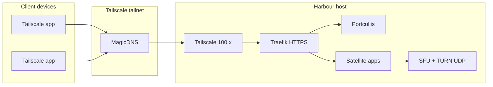

# Tailscale remote access

Access Harbour from outside your home network over a **private Tailscale tailnet**. Family phones and laptops run the Tailscale app; the Harbour host runs the stack plus Tailscale. No router port-forwarding and no public internet exposure.

**Hostname scheme:** `harbour.<tailnet>.ts.net` (shell + all apps at path prefixes `/notes`, `/chat`, …).

Local development with `/etc/hosts` and `harbour.local` is unchanged — see [phase-0-setup.md](./phase-0-setup.md).

**End-to-end Podman deploy:** [deploy-podman-tailscale.md](./deploy-podman-tailscale.md) — step-by-step from host prep through family phone setup.

---

## Architecture



---

## Prerequisites

- Tailscale account and a tailnet ([tailscale.com](https://tailscale.com))
- Harbour stack running on a home server (Podman or Docker)
- **MagicDNS** enabled in the Tailscale admin console (DNS → MagicDNS)

---

## 1. Harbour host — install Tailscale

On the machine running `harbour-infra`:

```bash
# Fedora / RHEL example
sudo dnf install tailscale
sudo systemctl enable --now tailscaled
sudo tailscale up
```

Note the host’s stable tailnet IPv4:

```bash
tailscale ip -4
# e.g. 100.64.0.1
```

Optional: rename the machine to `harbour` in the admin console so MagicDNS includes `harbour.<tailnet>.ts.net`.

Tag the node `tag:harbour` if you use ACLs (see below).

---

## 2. Configure compose for Tailscale

Copy the example env and edit placeholders:

```bash
cd harbour-infra
cp compose/.env.tailscale.example compose/.env
# Edit compose/.env:
#   - Replace tailabc123 with your tailnet name
#   - Set HARBOUR_TAILSCALE_IP to your 100.x address
#   - Set SESSION_SECRET and POSTGRES_PASSWORD
#   - Prefer Docker + port 443 for phones (see Runtime section)
```

Key variables:

| Variable | Example | Purpose |
|----------|---------|---------|
| `HARBOUR_DEPLOY_PROFILE` | `tailscale` | Skips `/etc/hosts` check; includes tailscale compose overlay |
| `HARBOUR_DNS_ZONE` | `harbour.tailabc123.ts.net` | Shell hostname; apps use `{app}.${HARBOUR_DNS_ZONE}` |
| `HARBOUR_COOKIE_DOMAIN` | `.harbour.tailabc123.ts.net` | SSO cookie shared across app subdomains |
| `HARBOUR_TAILSCALE_IP` | `100.64.0.1` | WebRTC SFU announced IP |
| `HARBOUR_PUBLIC_HTTPS_PORT` | `443` (Docker) or `8443` (Podman rootless) | Browser URL port |
| `PORTCULLIS_ISSUER` / `VITE_*` | Must match public HTTPS origin | Auth redirects and UI build args |

Generate synced config files (harbour-apps, OAuth clients, launcher registry, DNS checklist):

```bash
./scripts/generate-public-config.sh
```

This writes [`tailscale-dns-records.txt`](./tailscale-dns-records.txt) and `config/dnsmasq/harbour-tailscale.conf` — use them in the next step.

Rebuild and start:

```bash
# Docker (recommended for remote phones)
./scripts/docker/up.sh --build

# Podman rootless (uses :8443)
./scripts/up.sh --build
```

When `HARBOUR_DEPLOY_PROFILE=tailscale`, `up.sh` runs the generator automatically before compose.

---

## 3. Tailscale machine name (MagicDNS)

Rename the Harbour server to **`harbour`** so MagicDNS resolves `harbour.<tailnet>.ts.net`. Satellite apps are served at path prefixes on that same host (`/notes`, `/chat`, …) — no split DNS required.

1. Rename machine in Tailscale admin → Machines
2. Set `HARBOUR_DNS_ZONE=harbour.<tailnet>.ts.net` in `compose/.env`
3. Run `./scripts/generate-public-config.sh` and rebuild

Verify from a tailnet device:

```bash
getent hosts harbour.<tailnet>.ts.net
curl -kI https://harbour.<tailnet>.ts.net:8443/notes/health
```

Full walkthrough: [deploy-podman-tailscale.md — Step 3](./deploy-podman-tailscale.md#step-3--tailscale-machine-name-magicdns).

---

## 4. Client devices (phones, laptops)

1. Install [Tailscale](https://tailscale.com/download) and sign in to the **same tailnet**.
2. Ensure MagicDNS is enabled for the device (default on mobile apps).
3. Open the shell URL:
   - Docker: `https://harbour.<tailnet>.ts.net`
   - Podman rootless: `https://harbour.<tailnet>.ts.net:8443`
4. Accept the self-signed certificate warning (first visit), or install a custom SAN cert (see TLS below).
5. Sign in with a user created via `user-admin.sh`.

No `/etc/hosts` edits are required on clients when MagicDNS resolves the machine name.

---

## 5. Users and app access

Same as local deploy:

```bash
./scripts/user-admin.sh users create --email you@family.example --name "You" --password 'strong-password'
./scripts/user-admin.sh users grant-app --email you@family.example --app notes
./scripts/user-admin.sh users grant-app --email you@family.example --app recipes
```

---

## 6. Runtime: Docker vs Podman

| | Docker (`scripts/docker/up.sh`) | Podman rootless (`scripts/up.sh`) |
|---|-----|-----|
| HTTPS port | 443 | 8443 |
| Phone URLs | `https://harbour.<tailnet>.ts.net` | `https://harbour.<tailnet>.ts.net:8443` |
| `HARBOUR_PUBLIC_HTTPS_PORT` | 443 | 8443 |
| Issuer / VITE URLs | No port suffix | Include `:8443` |

**Recommendation:** use **Docker on port 443** for the simplest mobile experience.

After changing any public URL, run `./scripts/generate-public-config.sh` and rebuild images.

---

## 7. TLS certificates

With `HARBOUR_DEPLOY_PROFILE=tailscale` and **HTTPS certificates** enabled in Tailscale admin, Traefik uses a **Let's Encrypt** cert via the Tailscale cert resolver (`traefik.podman.tailscale.yml`). Browsers on the tailnet trust it without warnings.

```bash
./scripts/verify-tls.sh   # curl without -k should succeed
```

See [deploy-podman-tailscale.md — Step 3](./deploy-podman-tailscale.md#step-3--tailscale-machine-name--trusted-https) for setup.

Local `harbour.local` dev still uses Traefik's default self-signed cert.

---

## 8. Install as app (Android / PWA)

After trusted HTTPS works, open the shell URL in Chrome → **Install app**. One install covers the launcher and all path-based satellites (`/notes`, `/chat`, …). Manifest lives in `harbour-platform-ui/public/manifest.webmanifest`.

---

## 9. Voice / WebRTC (chat)

For voice channels off-LAN, set in `compose/.env`:

```bash
SFU_ANNOUNCED_IP=<Harbour host Tailscale IP>
CHAT_VOICE_TURN_URLS=stun:harbour.<tailnet>.ts.net:13478,turn:harbour.<tailnet>.ts.net:13478?transport=udp
TURN_REALM=harbour.<tailnet>.ts.net
```

TURN/STUN use the shell hostname on UDP port `13478`.

UDP ports must be reachable on the tailnet (defaults: SFU `14050–14150`, TURN relay `14200–14300`). Include them in ACLs if you restrict traffic.

**Verification:** join a voice channel from a phone on LTE (Tailscale connected); confirm bidirectional audio with another user.

---

## 10. ACL template (optional)

Restrict who can reach the Harbour host:

```json
{
  "acls": [
    {
      "action": "accept",
      "src": ["group:family"],
      "dst": [
        "tag:harbour:443",
        "tag:harbour:8443",
        "tag:harbour:13478",
        "tag:harbour:14050-14150",
        "tag:harbour:14200-14300"
      ]
    }
  ],
  "tagOwners": {
    "tag:harbour": ["autogroup:admin"]
  }
}
```

Apply tags in the Tailscale admin console and define a `group:family` for household devices.

---

## Troubleshooting

### Hostname does not resolve on phone

- Confirm MagicDNS is on for the tailnet and device.
- Confirm the machine is renamed to `harbour` and `HARBOUR_DNS_ZONE` matches.
- Run `tailscale status` on the client.

### Sign-in redirect loop

- `PORTCULLIS_ISSUER`, `VITE_OIDC_ISSUER`, and `VITE_HARBOUR_SHELL_URL` must match the URL in the browser (including port).
- Re-run `./scripts/generate-public-config.sh` and rebuild Portcullis + platform UI.

### 401 on satellite apps

- Sign in at the shell URL first (sets cookie for `.harbour.<tailnet>.ts.net`).
- Confirm `SESSION_COOKIE_DOMAIN` matches the cookie scope.

### Voice connected but no remote audio

- `SFU_ANNOUNCED_IP` must be the host Tailscale IP, not `127.0.0.1`.
- `CHAT_VOICE_TURN_URLS` must use the shell hostname (`harbour.<tailnet>.ts.net:13478`).
- Check UDP ACLs and that SFU/TURN containers are healthy.

---

## Related docs

- [**Deploy with Podman + Tailscale**](./deploy-podman-tailscale.md) — full platform deployment guide
- [Phase 0 setup](./phase-0-setup.md) — local `/etc/hosts` development
- [hosts.example](./hosts.example) — local hostname list
- [Chat Phase 4 WebRTC](../harbour-chat/docs/design/chat-phase-4-webrtc-sfu.md) — voice transport details
